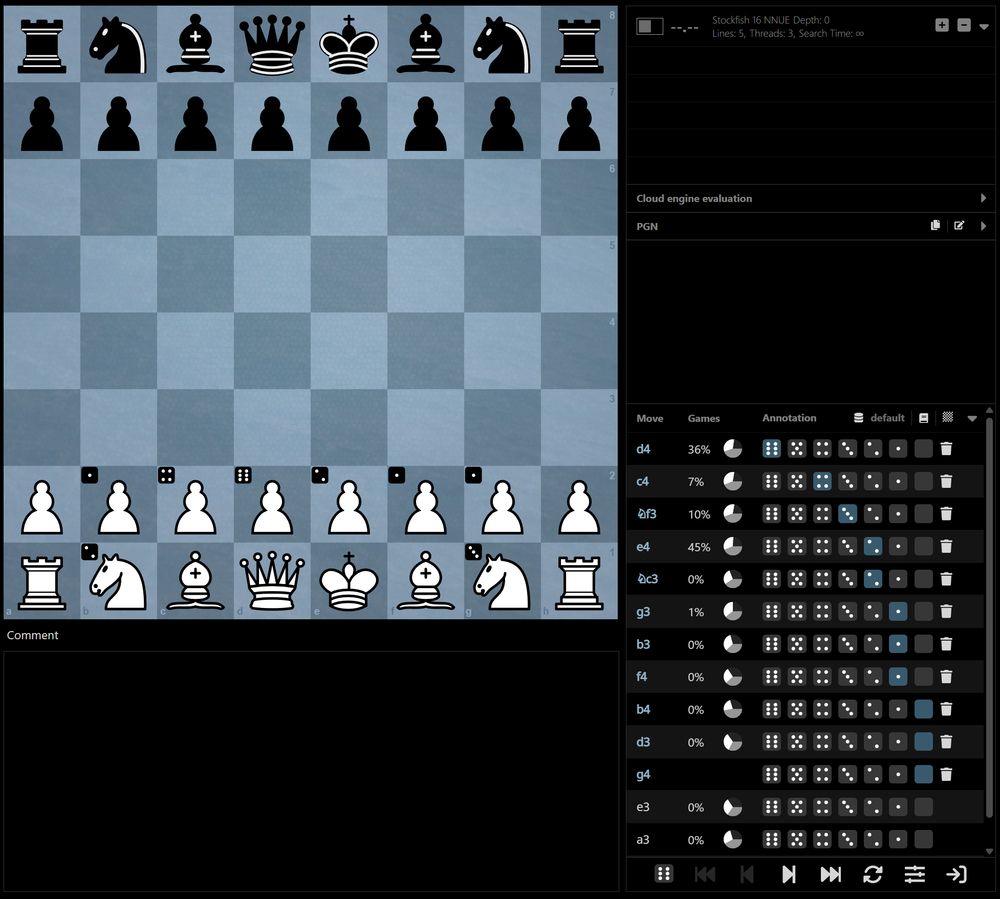
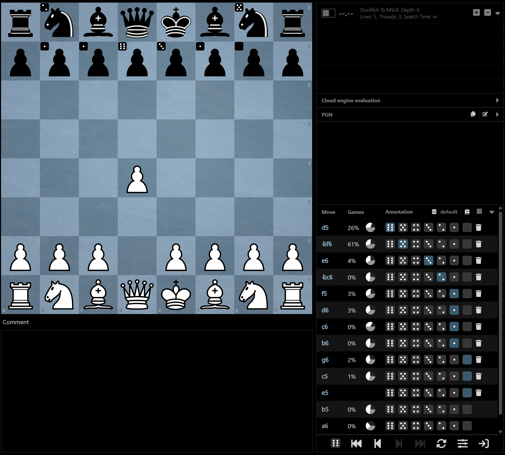

# ♟ Chess Repertoire Manager

A free, open-source web application for building and managing your chess opening repertoire — entirely in your browser.

**[Try it live →](https://cymantex.github.io/chess-repertoire/)**

## Why?

Traditional chess software like ChessBase forces you to juggle individual PGN files — one per opening, variation, or idea. This quickly becomes a mess, and the PGN format tends to be difficult to work with when you have a growing number of variations.

Chess Repertoire Manager takes a different approach, inspired by the underrated opening explorer from the classic **Chessmaster** program. Instead of maintaining hundreds (or thousands) of PGN files, you store your entire repertoire in one place. Just play moves on the board and they're saved into your repertoire automatically. Annotate each move to describe how likely you are to play it, add comments, and you have a complete, browsable repertoire without ever touching a PGN file.

If you prefer to just explore without saving, you can switch to **view mode** to navigate freely.

## How It Works

Here's what the app looks like when browing my own repertoire:



Each move in the opening explorer is *annotated* with a dice symbol indicating how likely I am to play it. In this example you can see that I'm primarily a `1. d4` player who likes to mix in `1. c4` and `1. Nf3` from time to time, with other first moves reserved for rare occasions. Moves with a blank annotation — like `1. g4`, `1. b4`, and `1. d3` — are ones I would never play. Moves that aren't highlighted in blue (`1. e3`, `1. a3`) haven't been analyzed and stored in the repertoire yet.

After playing `1. d4` on the board, the explorer updates to show my annotations from Black's perspective:



## Features

### 🔎 Opening Explorer

Browse opening theory using the **Lichess** and **Masters** databases. View win/draw/loss statistics and top games for any position to make informed choices about your repertoire lines.

### 🤖 Engine Analysis

Analyze positions with **Stockfish 16 NNUE** running locally in your browser via WebAssembly. Configure multi-PV lines (up to 10), search time, and thread count. Cloud engine evaluations are also available for quick lookups.

### 📝 Move Annotations & Comments

Annotate your moves with standard chess annotations — from brilliant (!!) to blunder (??). Choose between multiple annotation icon themes (default, pieces, dice). Add rich-text comments to any position using the built-in editor.

### 📂 PGN Import & Export

Import existing repertoires or games from PGN files and export your entire repertoire back to PGN. Large imports are processed in chunks with progress reporting via Web Workers.

### ☁️ Google Drive Sync

Optionally back up and sync your repertoire to Google Drive so you can access it from anywhere.

### 🗄️ Multiple Repertoire Databases

Create, switch between, and manage multiple named repertoire databases — all stored locally in IndexedDB.

### 🎨 Theming

Customize the look and feel with selectable board themes, piece sets, annotation styles, and site-wide color themes (dark/light).

### ⌨️ Keyboard Shortcuts

| Key | Action |
|---|---|
| `←` / `→` | Previous / Next move |
| `↑` / `↓` | Last move / First move |
| `1`–`7` | Set annotation (Brilliant → Blunder) |
| `8` | Clear annotation |
| `9` | Don't save move |
| `F` | Flip board |
| `E` | Export repertoire |

### 📱 Responsive Layout

Works on both desktop and mobile. The sidebar is collapsible and the layout adapts to your screen size with a resizable split view.

## Tech Stack

| | |
|---|---|
| **Framework** | [React 19](https://react.dev/) with TypeScript |
| **Build Tool** | [Vite](https://vitejs.dev/) (SWC) |
| **State Management** | [Zustand](https://github.com/pmndrs/zustand) |
| **Chessboard** | [Chessground](https://github.com/lichess-org/chessground) (Lichess board UI) |
| **Chess Logic** | [chess.js](https://github.com/jhlywa/chess.js) + [chessops](https://github.com/niklasf/chessops) |
| **Engine** | [Stockfish 16 NNUE](https://stockfishchess.org/) (WASM) |
| **Storage** | IndexedDB ([idb](https://github.com/jakearchibald/idb)) + localStorage |
| **Styling** | [Tailwind CSS](https://tailwindcss.com/) + [DaisyUI](https://daisyui.com/) + Sass |
| **Rich Text** | [Slate](https://docs.slatejs.org/) |
| **Data Fetching** | [TanStack Query](https://tanstack.com/query) + Axios |

## Getting Started

### Prerequisites

- [Node.js](https://nodejs.org/) (LTS recommended)

### Installation

```bash
# Clone the repository
git clone https://github.com/cymantex/chess-repertoire.git
cd chess-repertoire

# Install dependencies
npm install

# Start the development server
npm run dev
```

The app will be available at `http://localhost:5173/chess-repertoire/`.

### Build

```bash
npm run build
npm run preview
```

### Lint

```bash
npm run lint
```

## Acknowledgements

Special thanks to **[Lichess](https://lichess.org/)** — not only for providing the opening explorer APIs that power this app, but for championing open-source chess software in general. This project wouldn't exist without the incredible ecosystem they've helped foster.

This app also stands on the shoulders of several outstanding open-source chess libraries:

- **[Chessground](https://github.com/lichess-org/chessground)** — the beautiful, performant board UI from Lichess
- **[chess.js](https://github.com/jhlywa/chess.js)** — move generation, validation, and game logic
- **[chessops](https://github.com/niklasf/chessops)** — PGN parsing and chess operations
- **[Stockfish](https://stockfishchess.org/)** — the strongest open-source chess engine in the world

## License

This project is licensed under the [GNU Affero General Public License v3.0](LICENCE).
